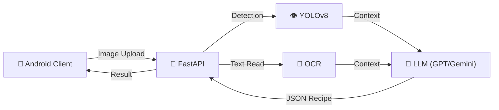

# 🥗 AI Smart Chef: 비전 인식 기반 냉장고 파먹기 솔루션


> **"냉장고 속 재료 사진 한 장이면, 오늘 저녁 메뉴 고민 끝!"**
> YOLOv8 객체 인식과 LLM의 추론 능력을 결합하여, 보유한 식재료에 최적화된 레시피를 제안하는 안드로이드 애플리케이션입니다.


## 📱 Demo Preview
| 재료 촬영 및 인식 | 레시피 생성 결과 |
| :---: | :---: |
|  |  |

## 🏗 System Architecture

Hybrid AI System을 구축하여 시각 정보(Vision)와 텍스트 정보(OCR)를 LLM의 Context로 활용했습니다.



## 💡 Key Features & Technical Details
| 기능 | 설명 |
| -- | -- |
| AI 식재료 인식 | 카메라로 재료를 촬영하면 서버의 객체 탐지 모델이 재료 종류를 분석합니다. |
| 장바구니 관리 | 인식된 재료는 앱 내 장바구니에 담기며, 영어로 인식된 재료명은 자동으로 한글로 번역되어 표시됩니다. |
| 맞춤형 레시피 추천 | 현재 가진 재료를 기반으로 생성형 AI가 요리 목록(이름, 조리 시간, 설명)을 제안합니다. |
| 상세 조리법 제공 | 요리를 선택하면 필요한 재료 리스트, 단계별 조리 과정, 셰프의 꿀팁을 상세하게 보여줍니다. |

### 1️⃣ Custom Object Detection (YOLOv8)
기존 모델의 한계를 넘어, 한국 식생활에 필수적인 **20가지 식재료**를 직접 학습시켰습니다.
- **Classes (20 types):** - 🥬 채소류: 양파, 대파, 마늘, 토마토, 감자, 당근, 피망/파프리카, 버섯, 양배추, 오이, 고추
  - 🥩 단백질류: 계란, 붉은 고기, 생선, 두부
  - 🥛 기타: 빵, 치즈, 사과, 우유
- **Performance:** - 다양한 조명과 각도(껍질 깐 양파 vs 안 깐 양파 등)를 고려한 데이터 증강(Augmentation) 적용.
  - mAP@0.5: **0.82** (여기에 네가 학습시킨 모델 점수 적어, 보통 0.8~0.9 나오면 훌륭해)

### 2️⃣ Multi-Modal Integration
단순 식재료뿐만 아니라, 포장된 제품의 라벨(OCR)까지 인식하여 LLM에게 전달함으로써 추천의 정확도를 높였습니다.

### 3️⃣ LLM Prompt Engineering
단순히 재료를 나열하는 것이 아니라, 요리 추천의 완성도를 위해 프롬프트를 최적화했습니다.
- **Role 부여:** 전문 셰프 페르소나 적용
- **Output Format:** 앱 파싱을 위한 Strict JSON 포맷팅 강제

## 🛠 Troubleshooting
(개발하면서 어려운점 적기)
### 문제 상황: 유사한 외형의 객체 오인식 (두부 vs 치즈)
흰색 직육면체 형태인 '두부'와 노란색 사각형인 '치즈'가 조명에 따라 혼동되는 현상 발생.

### 해결 방안
1. **데이터셋 정제:** 두부는 주로 '플라스틱 용기'에 담긴 데이터, 치즈는 '비닐 포장' 데이터를 집중적으로 추가 학습.
2. **Confidence Threshold 조정:** 특정 클래스에 대해 임계값을 다르게 설정하여 오탐지(False Positive) 최소화.

## 🚀 Installation & Usage

### Backend (FastAPI)
```bash
git clone [repo_url]
pip install -r requirements.txt
python main.py
