# 냉장고를 부탁해 : 비전 인식 기반 냉장고 파먹기 솔루션


> **"냉장고 속 재료 사진 한 장이면, 오늘 저녁 메뉴 고민 끝!"**
> YOLOv8 객체 인식과 LLM의 추론 능력을 결합하여, 보유한 식재료에 최적화된 레시피를 제안하는 안드로이드 애플리케이션

## 프로젝트 소개
> **"냉장고를 부탁해"** 는 사용자가 가진 식재료를 카메라로 촬영하면, 딥러닝 모델이 재료를 인식하고 LLM이 해당 재료로 만들 수 있는 최적의 레시피를 추천해 주는 안드로이드 애플리케이션
> 기존의 복잡한 검색 없이, "찍고, 확인하고, 요리하는" 직관적인 경험을 제공

## 주요 기능
| 기능 | 설명 |
| -- | -- |
| AI 식재료 인식 | 카메라로 재료를 촬영하면 서버의 객체 탐지 모델이 재료 종류를 분석 |
| 장바구니 관리 | 인식된 재료는 앱 내 장바구니에 담기며, 영어로 인식된 재료명은 자동으로 한글로 번역되어 표시 |
| 맞춤형 레시피 추천 | 현재 가진 재료를 기반으로 생성형 AI가 요리 목록(이름, 조리 시간, 설명)을 제안 |
| 상세 조리법 제공 | 요리를 선택하면 필요한 재료 리스트, 단계별 조리 과정, 셰프의 꿀팁을 상세하게 보여줌 |

## 기술 스택
### Android (Client)
* Language: Kotlin

* UI Toolkit: Jetpack Compose (Modern UI), Material Design 3

* Architecture: MVVM (Model-View-ViewModel), Clean Architecture 지향

* Navigation: Jetpack Navigation Compose (Single Activity Architecture)

* Network: Retrofit2, OkHttp3

* Concurrency: Coroutines, Flow (StateFlow, SharedFlow)

* Image Loading: Coil

* Camera: CameraX (Custom implementation)

### Backend & AI (Server)

* Framework: Python (FastAPI)

* Object Detection: Custom Trained Model (YOLO/PyTorch)

* Generative AI: Google Gemini API (Recipe Generation)

* Data Validation: Pydantic V2


## 📱 Demo Preview
| 재료 촬영 및 인식 | 레시피 생성 결과 |
| :---: | :---: |
|  |  |

## 🏗 System Architecture

Hybrid AI System을 구축하여 시각 정보(Vision)와 텍스트 정보(OCR)를 LLM의 Context로 활용

```mermaid
graph LR
    User["📱 Android Client"] -->|"이미지 업로드"| Server["📡 FastAPI"]
    Server -->|"객체 인식"| YOLO["👁️ YOLOv8"]
    Server -->|"텍스트 읽기"| OCR["📝 OCR"]
    YOLO & OCR -->|"재료 데이터 제공"| LLM["🤖 LLM (GPT/Gemini)"]
    LLM -->|"요리 레시피"| Server
    Server -->|"결과"| User
```



### 1️. Custom Object Detection (YOLOv8)
기존 모델의 한계를 넘어, 한국 식생활에 필수적인 **20가지 식재료**를 직접 학습
- **Classes (20 types):** - 🥬 채소류: 양파, 대파, 마늘, 토마토, 감자, 당근, 피망/파프리카, 버섯, 양배추, 오이, 고추
  - 🥩 단백질류: 계란, 고기, 생선, 두부
  - 🥛 기타: 빵, 치즈, 사과, 우유
- **Performance:** - 다양한 조명과 각도(껍질 깐 양파 vs 안 깐 양파 등)를 고려한 데이터 증강(Augmentation) 적용.
  - mAP@0.5: **0.82**

### 2️. Multi-Modal Integration
단순 식재료뿐만 아니라, 포장된 제품의 라벨(OCR)까지 인식하여 LLM에게 전달함으로써 추천의 정확도를 높임

### 3️. LLM Prompt Engineering
단순히 재료를 나열하는 것이 아니라, 요리 추천의 완성도를 위해 프롬프트를 최적화
- **Role 부여:** 전문 셰프 페르소나 적용
- **Output Format:** 앱 파싱을 위한 Strict JSON 포맷팅 강제

## 기술적 의사결정
> LangChain을 사용한 이유

### 정형화된 데이터(Json)가 필수

LLM은 기본적으로 확률에 기반하여 비정형 텍스트를 생성하지만, 앱 서비스에서는 UI에 바인딩하기 위해 Json 형태의 데이터가 필수적

1. Raw SDK 사용할 경우
   - 가볍다
   - 모델이 반환하는 텍스트에 'JSON 형태로 생성해'를 무조건적으로 사용해야 함.
   - 클라이언트에서 파싱 에러를 방지하기 위한 정규식 처리 등 복잡한 예외 처리가 필요
2. LangChain + Pydantic 사용할 경우
   - OutputParser를 통해 모델의 출력을 특정 스키마로 강제할 수 있음
    ```python
    class LlmService:
    def __init__(self):
        self.llm = ChatGoogleGenerativeAI(
            model="gemini-2.5-flash",
            temperature=0.1,
            api_key=os.getenv("GEMINI_API_KEY")
        )

    # [기능 1] 요리 목록 추천
    async def get_recipe_list(self, ingredients: list):
        # Pydantic V2 객체를 넣어주면 알아서 인식합니다.
        parser = PydanticOutputParser(pydantic_object=RecipeListResponse)

        prompt = ChatPromptTemplate.from_template("""
        너는 한식 전문 셰프야.
        냉장고 재료: {ingredients}
        이 재료들로 만들 수 있는 요리 3가지를 추천해줘.
        
        {format_instructions}
        """)

        chain = prompt | self.llm | parser

        return await chain.ainvoke({
            "ingredients": ", ".join(ingredients),
            "format_instructions": parser.get_format_instructions()
        })
    ```
    
   
    
 - 프롬포트 템플릿 관리가 용이하여 유지보수성이 높음
      ```python
     from pydantic import BaseModel, Field 
     from typing import List
     
     # --- [API 1: 목록 조회용 구조] ---
     class RecipeSummary(BaseModel):
         id: int = Field(description="1부터 시작하는 순번")
         dish_name: str = Field(description="요리 이름")
         description: str = Field(description="요리의 특징을 묘사한 한 줄 설명")
         cooking_time: str = Field(description="예상 조리 시간 (예: 15분)")
     
     class RecipeListResponse(BaseModel):
        recommendations: List[RecipeSummary] = Field(description="추천 요리 3가지 리스트")
     # --- [API 2: 상세 조회용 구조] ---
     class RecipeDetailResponse(BaseModel):
        dish_name: str = Field(description="요리 이름")
        ingredients_needed: List[str] = Field(description="필요한 재료 목록 (양념 포함)")
        recipe_steps: List[str] = Field(description="단계별 조리법")
        tips: str = Field(description="맛있게 만드는 셰프의 팁")

## 🛠 트러블슈팅
### 문제 상황1: 이미지 데이터 부족 현상 발생
각 재료 당 이미지 100장씩 사용해야 하는데 크롤링을 하더라도 사용하지 못할 이미지가 많아 100장이 안되는 현상이 일어남.
#### 해결 방안
1. **데이터 증강:** 50~70장 크롤링을 하여 구하고 나머지는 데이터 증강을 통해 이미지를 증가시킴.

### 문제 상황2 : YOLO로 인식된 재료가 전혀 맞지 않는 현상
사용자의 눈에는 '마늘'로 보이는데 YOLO가 인식한 재료는 엉뚱맞게 '생선'이나 '감자'로 인식하게 됨

#### 해결 방안
1. **다중 검토** : 총 3단계로 이루어진 검토 시스템을 도입함
   
   (1) OCR : 재료에 텍스트로 명칭이 적혀있다면(예: 마늘, 감자) 라벨이 그 명칭으로 인식함
   
   (2) LLM : 정확도가 일정 이하라면 모델이 인식한 이미지를 예측하지 않고 LLM이 예측하도록 함. 따라서 LLM이 예측한 결과를 내보냄
   
   (3) 사용자 검토 : 앱 자체에서 재료를 인식하자마자 요리 리스트를 출력하는 것이 아닌 장바구니 시스템을 접목시켜 사용자가 직접 확인하여 수정할 수 있도록 하였음

## 설치 및 실행
>이 프로젝트는 **Hugging Face Spaces** 클라우드 서버와 연동되어 있으므로 별도의 로컬 서버 구축 없이 Android 앱만 빌드하면 즉시 사용 가능

### 📋 Prerequisites
* **Android Studio** (Koala 이상 권장)
* **JDK 17** 이상
* **Internet Connection** (필수)

### 1. Server Status Check
현재 백엔드 서버는 Hugging Face Spaces에 배포되어 가동 중임
* **Base URL:** `https://alphgo-smart-recipe-server.hf.space/`
* **Docs:** `https://alphgo-smart-recipe-server.hf.space/docs`

### 2. Android App Setup

**1) 프로젝트 클론**
```bash
git clone [https://github.com/](https://github.com/)[본인의-깃허브-아이디]/SeeyouFridge.git
```

**2) API 주소 설정 **
`data/api/RetrofitClient.kt`파일에서 `BASE_URL`이 Hugging Face 주소로 되어 있는지 확인
```Kotlin
const val BASE_URL = "https://alphgo-smart-recipe-server.hf.space/"
```

**3) 앱 실행(run)**
 - Android Studio 상단의 Run 버튼을 클릭합니다.
 - 실물 기기에서 실행합니다
**주의:** 에뮬레이터로 테스트 할 시 별도의 카메라 설정을 하지 않으면 카메라 기능
